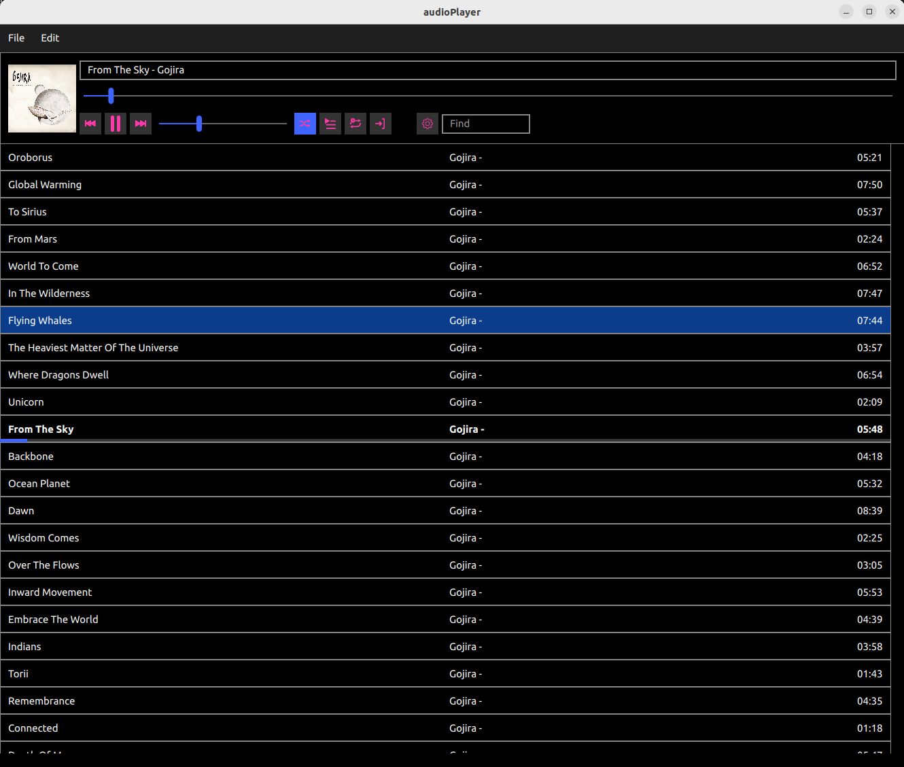
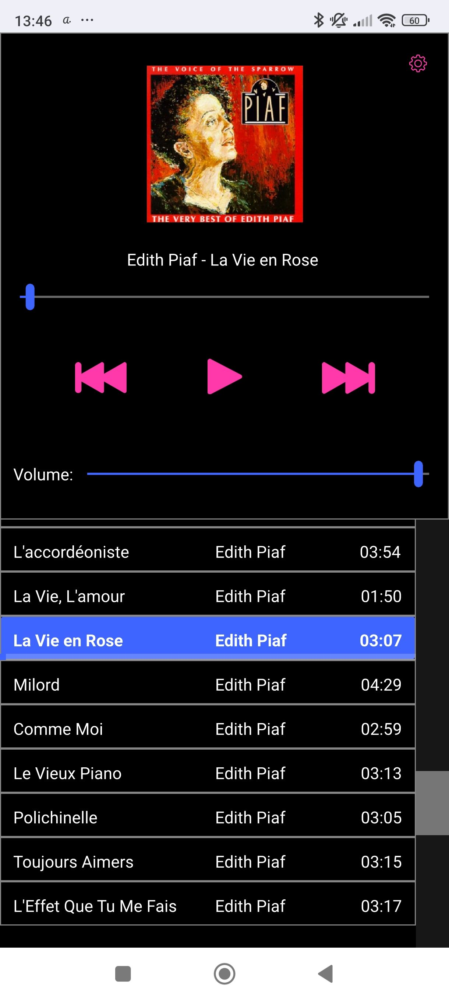

AudioPlayer
===========

**AudioPlayer** is a project started at the Dundalk Institute of Tecgnology (Ireland). 
The original goal was to implement an application using Qt and as many as possible design patterns. 

Since that, it has been rewritten a couple of times. 

# ScreenShot

## Stand Alone client




## Android client




# Binaries in this project:

|Binary|Description|
|--|--|
|AudioClient|Client that connects to the server, display the playlist and send command to the server. It can also play the music in remote mode (not working on all platform). |
|AudioPlayer|All in one application: playlist, audio features and views|
|AudioServer|AudioServer dedicated to be use in local network. It can play the music or send files to be played on the remote control application's device.|
|fsHelper| QWidget app to help renaming folders to improving the hierarchy of folder.|

# Current Features:

* Stand Alone application
* Headless server 
* Client
* Android Client
* Json Playlist
* Tags on song
* Playlist defined by tags
* Search
* MetaData reading
* UI in QML
* Playing on server side
* Playing on client side
* light and dark mode


# How to use

## Requirements

* Qt (6.8 or later)
* Qt Multimedia
* TagLib

## Compile it:

```bash

# Configuration 
cmake -S /path/to/source/audioPlayer -B buildir

# Build
cmake --build builddir --target all

```


## Run it 

This project is building 3 binaries:

* **audioPlayer**: stand alone application
* **audioServer**: headless application
* **audioClient**: remote client (can be compiled for Android)

You should run the **audioPlayer** in order to create a playlist with all your music. Then, you can use the server/client mode.


## Todo: 

* Remove hardcoded values
* User defined tags
* Add feature to create playlist in remote
* Many other things


